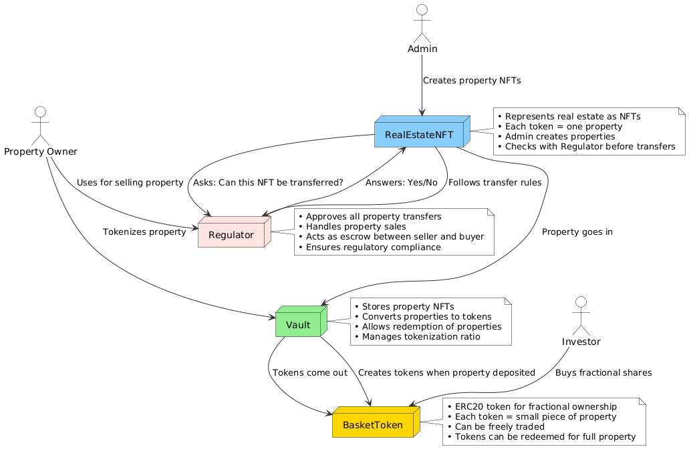
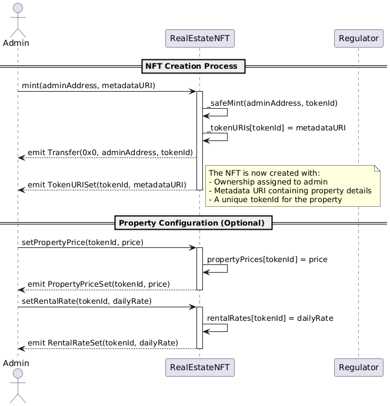
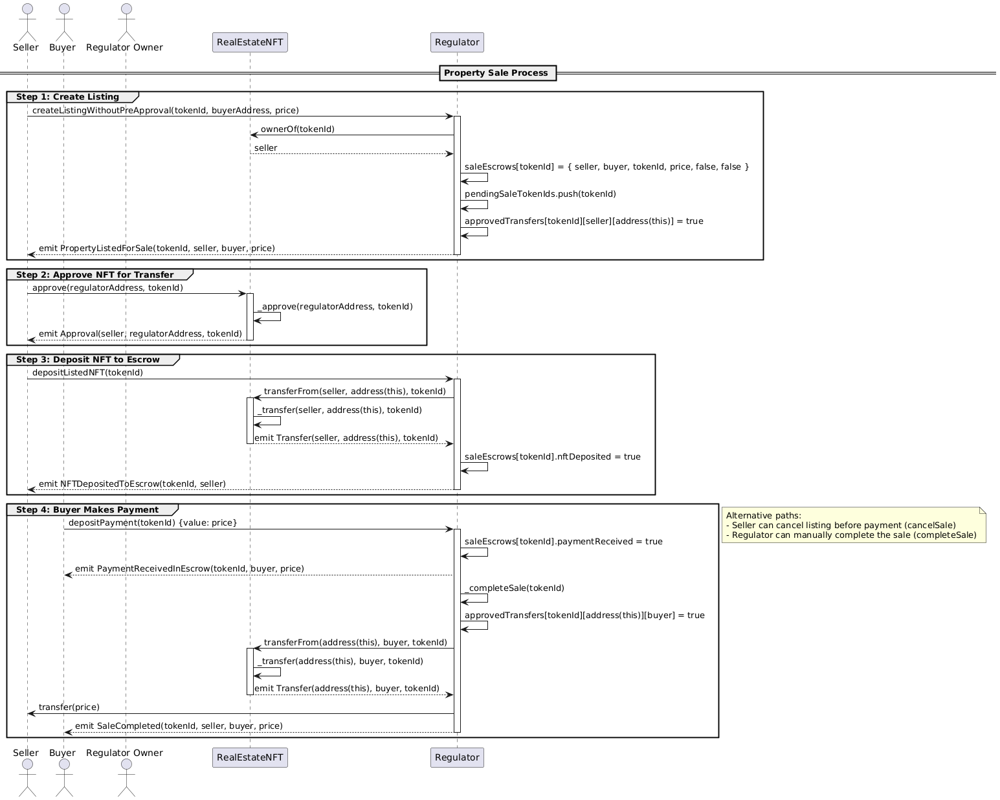
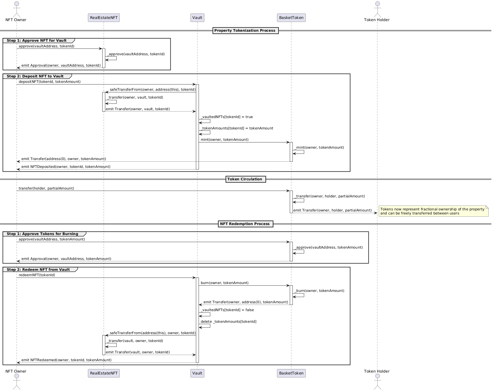

# Contract Overview

This document explains the smart contract architecture for the real estate tokenization platform, which enables property owners to tokenize real estate assets, sell properties through a regulated marketplace, and allow investors to own fractional shares of properties.

## Smart Contract Overview

The system consists of four primary smart contracts:

1. **RealEstateNFT**: ERC721 token representing real estate properties
2. **Regulator**: Controls property transfers and provides escrow services for sales
3. **Vault**: Holds NFTs and issues corresponding tokens
4. **BasketToken**: ERC20 token representing fractional ownership of properties

## Contract Relationships

The contracts work together to enable the following key processes:

1. Property tokenization (creating NFTs representing real estate)
2. Regulated property transfers
3. Property sales through escrow
4. Fractional ownership through tokenization

> PUML Diagram: [Contract Overview](./contract-overview.puml)

## Key Processes

### NFT Creation Process

1. Admin mints a new NFT with property metadata
2. Property details (price, rental rate) can be configured
3. NFT represents ownership of a unique property

> PUML Diagram: [Property NFT Creation Sequence](./property-nft-creation-sequence.puml)

### Property Sale Process

1. Seller creates a listing without pre-approval, specifying buyer and price
2. Seller approves the Regulator contract to transfer their NFT
3. Seller deposits the NFT to the Regulator (escrow)
4. Buyer sends payment to the Regulator
5. Upon payment, the Regulator transfers the NFT to the buyer and sends funds to the seller

> PUML Diagram: [Property Sale Sequence](./property-sale-sequence.puml)

### Property Tokenization Process

1. NFT owner approves the Vault to transfer their NFT
2. Owner deposits the NFT into the Vault, specifying token amount
3. Vault holds the NFT and mints BasketTokens to the owner
4. Owner can transfer tokens to investors, creating fractional ownership
5. Anyone holding all tokens can redeem the NFT from the Vault

> PUML Diagram: [Property Tokenization Sequence](./property-tokenization-sequence.puml)

## Contract Details

### RealEstateNFT

- Extends ERC721 standard for non-fungible tokens
- Implements IERC4907 for rental functionality
- Requires regulator approval for transfers
- Stores property metadata, prices, and rental rates

### Regulator

- Controls all property transfers (security layer)
- Provides escrow services for property sales
- Maintains listings and pending transfers
- Handles multi-step selling process (list, approve, deposit, pay)

### Vault

- Holds NFTs in exchange for basket tokens
- Manages the relationship between NFTs and tokens
- Allows token redemption for NFTs
- Maintains records of vaulted NFTs and token amounts

### BasketToken

- Standard ERC20 token for fractional ownership
- Minted when NFTs are deposited in the vault
- Burned when NFTs are redeemed
- Can be freely transferred between users

## Security Considerations

1. **Transfer Regulation**: All NFT transfers require approval from the Regulator
2. **Escrow Security**: Funds and NFTs are held in escrow during sales
3. **Access Control**: Critical functions restricted to appropriate roles
4. **Reentrancy Protection**: Guards against reentrancy attacks

## Deployment Sequence

For proper functioning, the contracts should be deployed in this order:

1. Deploy BasketToken
2. Deploy Regulator
3. Deploy RealEstateNFT (with Regulator address)
4. Deploy Vault (with NFT and BasketToken addresses)
5. Set Vault address in BasketToken 